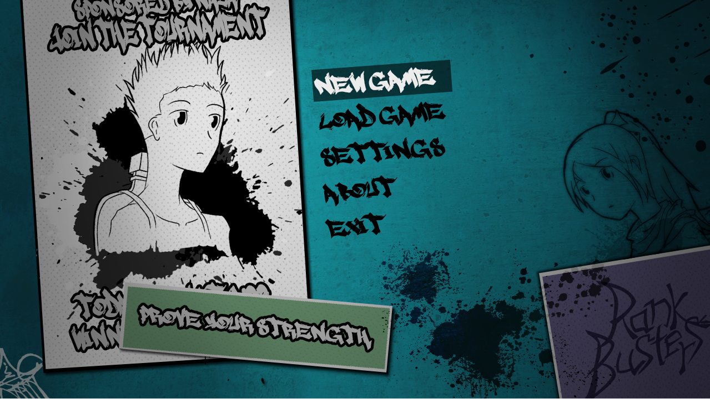
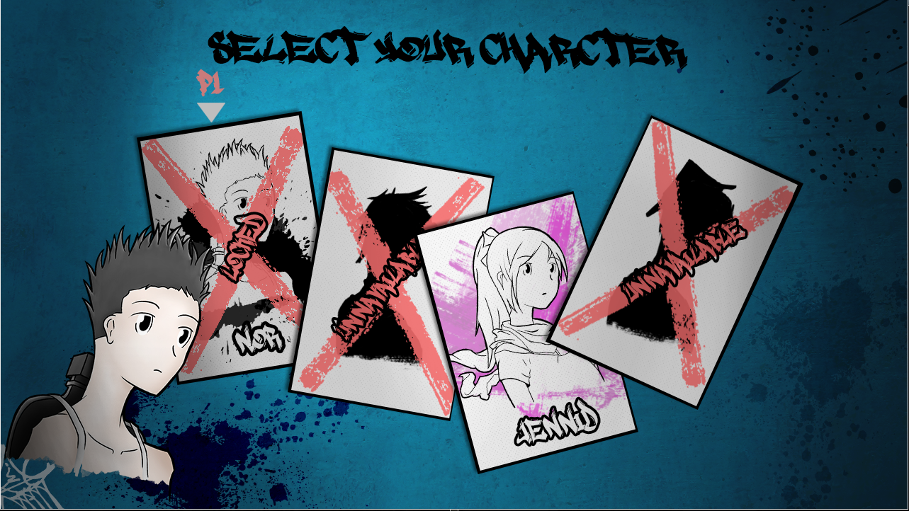
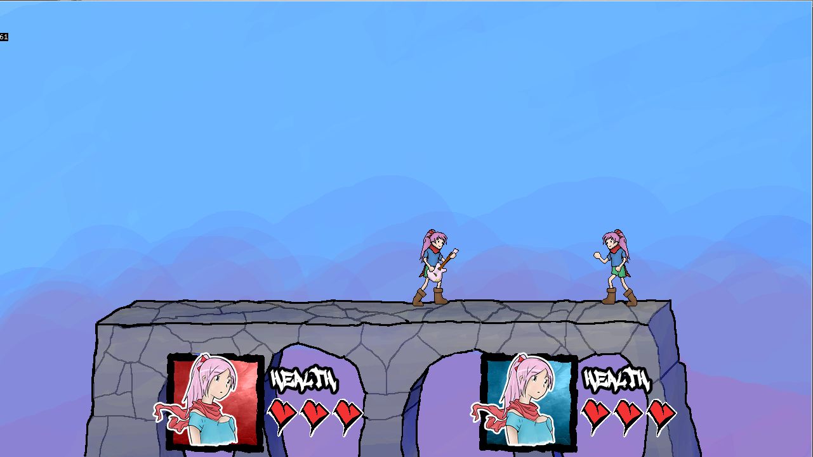
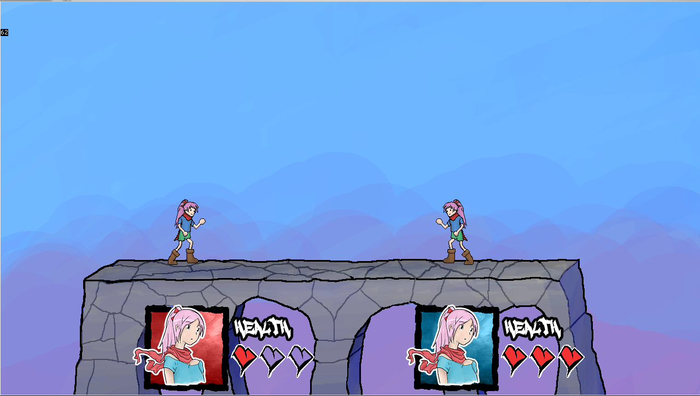

# About the game

This game was coded in 2 days for my A-Level computer science final year coursework.

All art assests where made in 2 days and where part of my Graphics A-Level final year coursework. 

Music is from The World Ends With You. 

For a working demo run the .exe at Demo/MonkeyGame.exe

## About Monkey X

Monkey X is a open source programming language with a small community.  

## To-do

+ Rewrite game in Monkey 2
+ Clean and optimize code
+ Improve annotations

## Some screenshots

